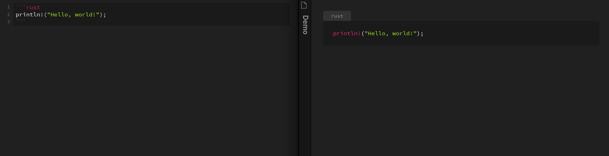
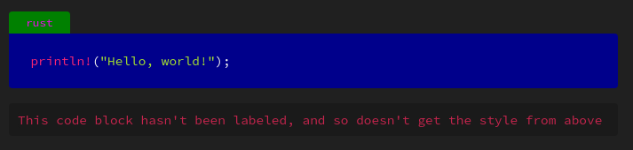

# Obsidian Code Block Labels Plugin

This plugin renders labels for code blocks.


The plugin can also be optionally configured to show the language as a label, if no explicit label was set



Labels are assigned the "codeblock-label" class and so can be styled with CSS:

```css
/* style the label itself */
.markdown-preview-view .codeblock-label {
  color: magenta;
  background: green;
}

/* style labeled codeblocks, which is a pre tag that comes directly after the label */
.markdown-preview-view .codeblock-label + pre {
  background: blue;
}
```


