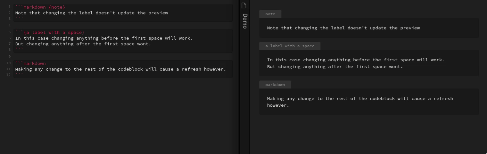

# Obsidian Code Block Labels Plugin

This plugin renders labels for fenced code blocks.

Add a label to a code block by putting it inside curly braces (`{}`) at the end of the first line of the fenced code block (after the language if applicable).


The plugin can also be optionally configured to show the language as a label, if no explicit label was set (this is enabled by default - see settings panel to turn off).


Labels are assigned the "codeblock-label" class and so can be styled with CSS:

```css
/* style the label */
.markdown-preview-view .codeblock-label {
  color: magenta;
  background: green;
}

/* to style the code block itself, but leave unlabled codeblocks untouched, select the pre tag that comes directly after the label */
.markdown-preview-view .codeblock-label + pre {
  background: blue;
}
```


## Refresh bug

There is a known issue where making a change to the label doesn't always cause the preview to update.
I am looking in to a potential fix, but I want to make sure I do it in the correct way :)

Because Obsidian tries to be efficient in it's Markdown rendering, it only updates the preview when it detects a change to the Markdown.
The syntax used here however doesn't always trigger this update, because Obsidian doesn't consider it valid Markdown syntax.

Specifically Obsidian only checks the first line of the code block *up to the first space or newline* for the language to use for syntax highlighting.
This means that if you have a space between the language and label (or if your label has a space in it), when you modify anything past that first
space it won't update the preview automatically.
To manually fix this, just make a change to any other part of the code block and it should trigger an update.



## Live preview

Currently this plugin does not support live preview.
The live preview works in a significantly different way than the "normal" preview, and I don't personally use live preview so have little incentive to make it work.
I'd be more than happy to accept a pull request though if anyone wants to take a look at it!

## Credit

This plugin is based off of the template plugin here https://github.com/obsidianmd/obsidian-sample-plugin
